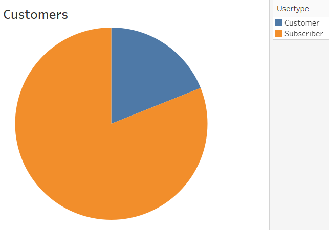
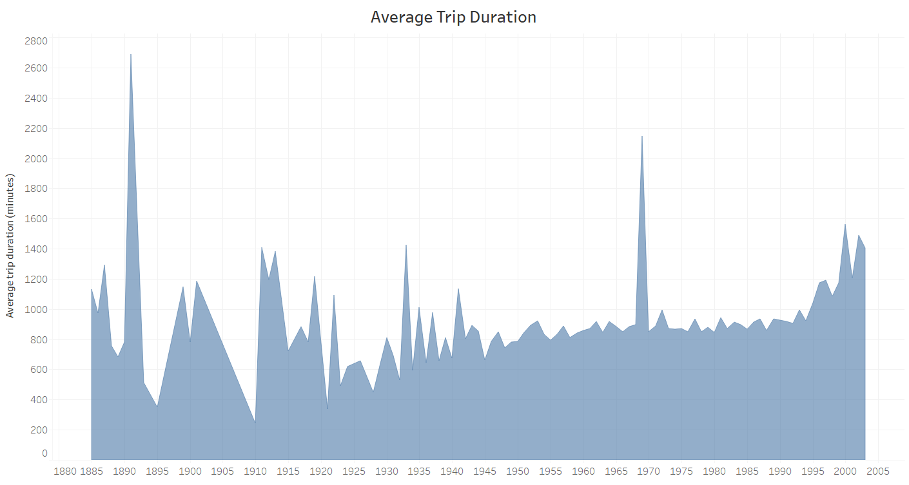
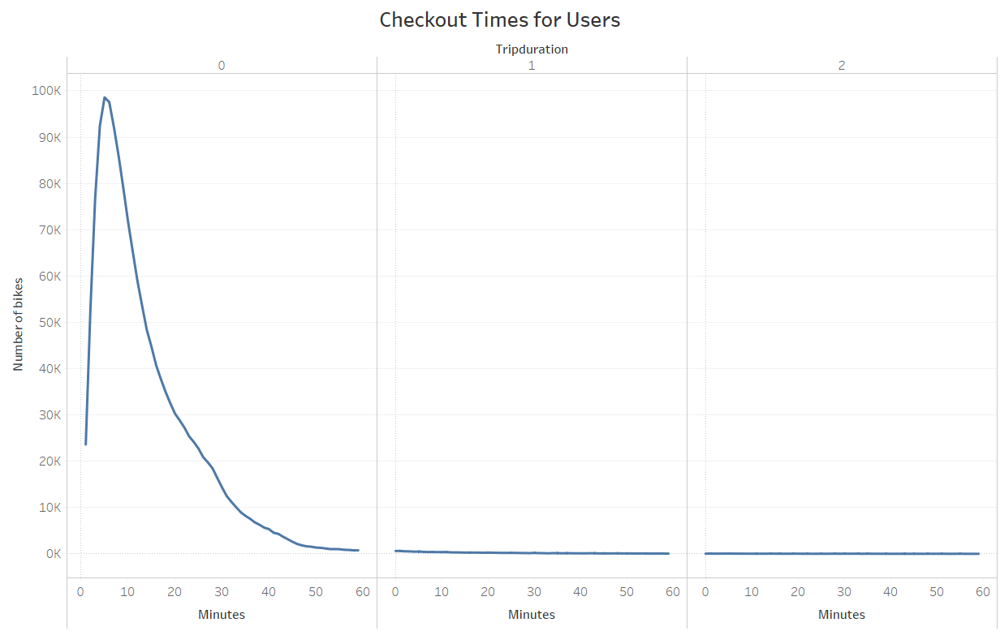
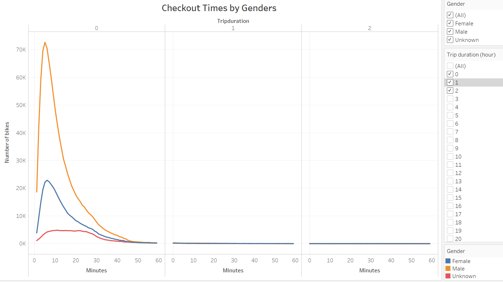
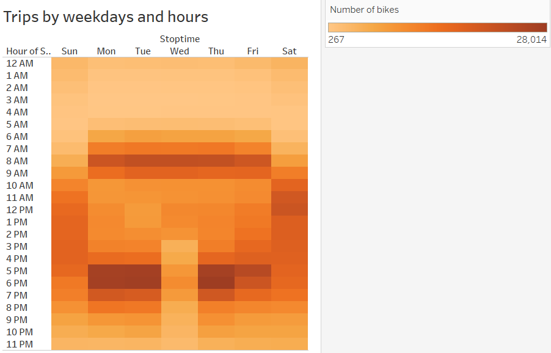
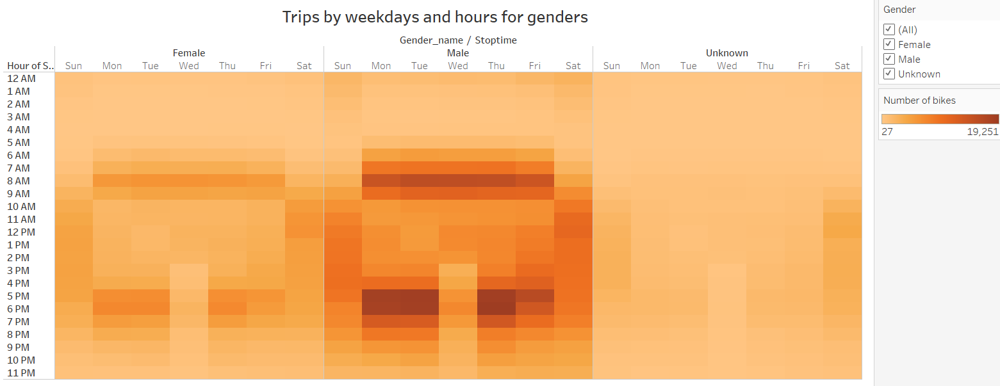
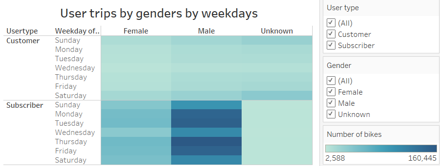

# Pewlett_Hackark_Analysis

## Overview of Project
This project is to investigate the relationship among the number of rides, trip durations, genders, usertype, day of the week, and the time of the day. The detail analysis is implemented on [NYC Bike Sharing Story 1](https://public.tableau.com/app/profile/dennis.phan/viz/NYC_Bike_Sharing_16326813013300/Story1?publish=yes) and [BNYC Bike Sharing Story 2](https://public.tableau.com/app/profile/dennis.phan/viz/BikeSharing_16326817117890/TopEndingLocations?publish=yes).

This project focuses on following items:
 - **User types** catetorizes number of users by regular customers and subscribers. 
 - **Trip duration by ages** shows the relationship between trip durations and ages.
 - **Checkout times** summarizes the number of rides by trip durations. 
 - **Checkout times by genders** presents the number of rides by trip durations and genders. 
 - **Trips by weekday and time** depicts the number of rides by the time of the day and the day of the week. 
 - **Trips by weekday, time, and genders** expresses the number of rides by time, weekday, and genders. 
 - **Trips by weekday, time, genders, and user types** presents the number of rides by time, weekday, genders, and user types. 

## Analysis

### User types
The total rides inspected in this project is 2,334,224. In those rides, 5/6 are subscribers and the remaining are regular customers. 

### Trip durations by ages
The trip durations of users who were born before 1925 fluctuate significantly. The lengthiest belongs to the those between 1890 and 1893 with up to 45 hours riding. For those who were born from 1925, the younger they are, the longer they ride. One exception is the group of people with birth year of around 1970. Their trip durations are long (up to 36 hours). 

### Checkout times
Almost all rides are under one hour. The number of bikes checked out are peak at 6 minutes in length and decrease as the lengths increase.

**Checkout times**

### Checkout times by genders
Most riders are male. The number of female riders are approximately one-third of male riders but are still around 4 times higher than riders with unknown genders. 

**Checkout times by genders**

### Trips by weekdays and times
The busiest times during weekdays are from 6 to 9 AM and 5 to 8 PM. At weekends, the times are spread out throughout the day. The busiest times are at noon, from 11AM to 12PM. 

**Trips by weekdays and times**

### Trips by weekdays, times, and genders
Most riders are male. A small portion of riders are female. The number of unknonwn gender are very few in comparison with the other two genders.

**Trips by weekdays, times, and genders**

### Trips by weekday, times, genders, and user types
Regular customers are generally less active. Many of them have unknown gender. In contrast, subcribers are very active, espcially male riders. The number of unknown gender riders are limited. 

**Trips by weekday, times, genders, and user types**

## Conclusion
 - The target customers should be male riders. 
 - Since young customers ride more, the company should focus on them as initial customers. 
 - Unsubcribed customers tend to not disclose their information, especially genders, while subcribers are more comfortable in disclosing their genders. 
 - During weekdays, most customers ride in the morning and in the afternoon. The company should utilize the dowm times to maintain and prepare bikes so that they are available during busy times. Advertisements should tackle these times of the day to attract attention.
 - At weekends, people ride less in the morning and in the evening but more from 9AM to 6PM. The number of rides are equally spead out during the day with the peak at noon (11AM to 12PM). Advertisements should be done periodically throughout the day. 

## Further analysis
 - Since male riders occupy more than 70% of total riders, further analysis should focus more on male riders such as starting stations, ending stations, ages, trip durations, etc. The more the company understand its target customers the more likely the company can come up with the right strategy to approach, attract, and retain them. 
